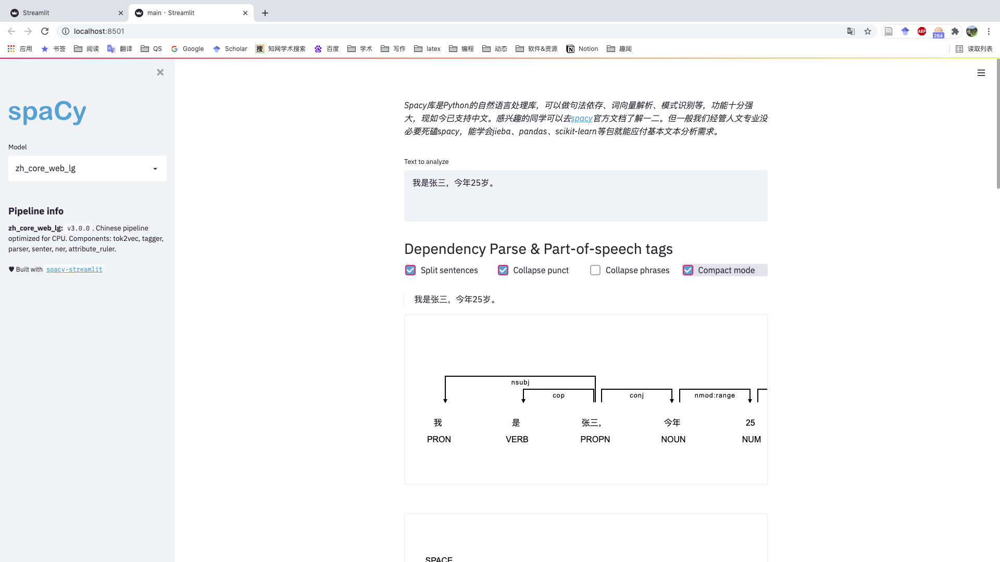

## spacyDemo

Spacy库是Python的自然语言处理库，可以做句法依存、词向量解析、模式识别等，功能十分强大，现如今已支持中文。感兴趣的同学可以去[spacy](https://spacy.io/api)官方文档了解一二。但一般我们经管人文专业没必要死磕spacy，能学会jieba、pandas、scikit-learn等包就能应付基本文本分析需求。




## Spacy配置步骤

1. 下载[en_core_web_lg](https://github.com/explosion/spacy-models/releases/download/en_core_web_lg-3.0.0/en_core_web_lg-3.0.0-py3-none-any.whl)和[zh_core_web_lg](https://github.com/explosion/spacy-models/releases/download/zh_core_web_lg-3.0.0/zh_core_web_lg-3.0.0-py3-none-any.whl)的whl文件，下载后放置于桌面。同时[将spacyDemo仓库下载](https://github.com/thunderhit/spacyDemo)至于桌面，解压。
2. 打开命令行(Win即为cmd； Mac即为terminal)， 执行**cd desktop**命令，将命令行切换至桌面路径。
3. 在命令行中依次执行下列安装配置命令

```
pip3 install en_core_web_lg-3.0.0/en_core_web_lg-3.0.0-py3-none-any.whl

pip3 install zh_core_web_lg-3.0.0/zh_core_web_lg-3.0.0-py3-none-any.whl

cd spacyDemo

pip3 install -r requirements.txt
```

4. 启动本地spacy网站，在命令行执行

```
streamlit run main.py
```

<br>

<br>


# 如果

如果您是经管人文社科专业背景，编程小白，面临海量文本数据采集和处理分析艰巨任务，可以参看[《python网络爬虫与文本数据分析》](https://ke.qq.com/course/482241?tuin=163164df)视频课。作为文科生，一样也是从两眼一抹黑开始，这门课程是用五年时间凝缩出来的。自认为讲的很通俗易懂o(*￣︶￣*)o，

- python入门
- 网络爬虫
- 数据读取
- 文本分析入门
- 机器学习与文本分析
- 文本分析在经管研究中的应用

感兴趣的童鞋不妨 戳一下[《python网络爬虫与文本数据分析》](https://ke.qq.com/course/482241?tuin=163164df)进来看看~
[](https://ke.qq.com/course/482241?tuin=163164df)

<br>

## 谢谢支持

- [**腾讯课堂: Python网络爬虫与文本分析**](https://ke.qq.com/course/482241?tuin=163164df)
- [**B站:大邓和他的python**](https://space.bilibili.com/122592901/channel/detail?cid=66008)
- [**github: DaDeng**](https://github.com/thunderhit)
- **公众号：大邓和他的python**


